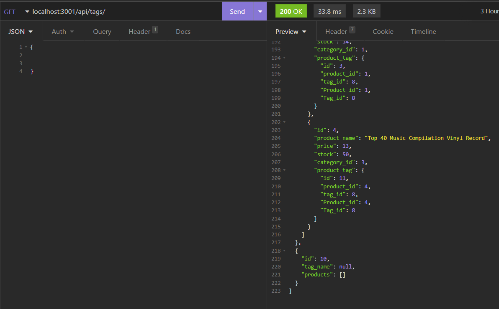

# 13 ORM: eCommerce BackEnd

## Description

An **object relational mapping (ORM)** backend for e-commerce site.  This includes Express.js API to use Sequelize to interact with MySQL database. Four route files have been modified and are shown in the video. 

### Technologies Used

Express.js
JavaScript
Sequelize


### Screenshot



### Link to Deployed
```
git@github.com:bussudo/ecommercesiteBE.git

### Link to Videos:
https://drive.google.com/file/d/1HgJ1GGAZwES2Pv5gXcN7pD58e57V9V2u/view
https://drive.google.com/file/d/1I0KJ0knFhfH5KNAVlrxZcahXgx7pszUl/view
https://drive.google.com/file/d/1GdNitSUXx7YjUHbVtNuRfp8S9T4xZ2LO/view
https://drive.google.com/file/d/1qdlmwGOfiUbBq3kGe51ieRWYZ-6MPjBz/view
https://drive.google.com/file/d/1hTakpekXh3vPsef5ei-x3AATQ5dl6PcV/view